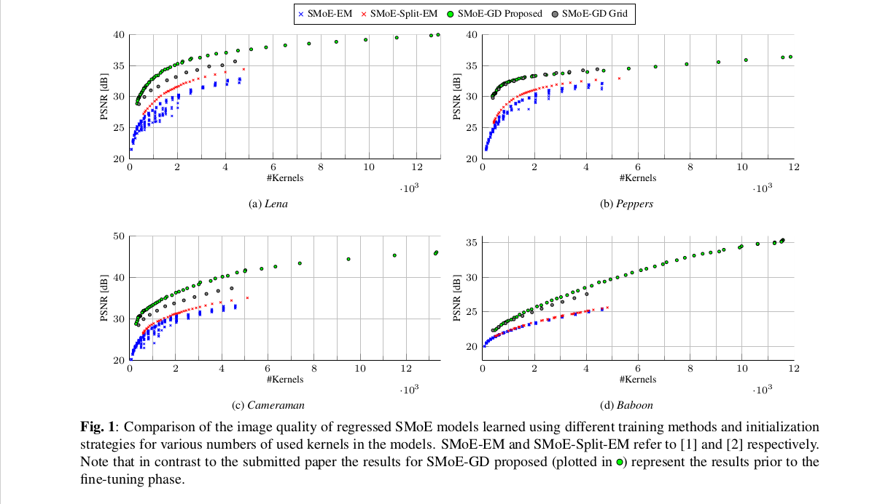

A Tensorflow-based implementation of the Steered Mixture-of-Experts (SMoE) image modelling approach described in the ICIP 2018 paper [Regularized Gradient Descent Training of Steered Mixture of Experts for Sparse Image Representation](http://elvera.nue.tu-berlin.de/files/1535Bochinski2018.pdf).


This repository contains the implementation of a reference class for training and regressing a SMoE model, an easy to use training script as well as a jupyter notebook which helps you getting started writing you own code with a more elaborate example.


## Getting started
### Installation

There are no special dependencies to run this code except python3 and the packages listed below.
It is recommended to use a virtual environment to run this code:

```
virtualenv -p python3 env
source env/bin/activate
pip install tensorflow-gpu matplotlib scikit-image scikit-learn
```


### Training a Model
A sample script with predefined default values for most of the parameters is included in this repository.
Usage:
```
(env)$ python train_model.py --help
usage: train_model.py [-h] -i IMAGE_PATH -r RESULTS_PATH [-n ITERATIONS]
                      [-v VALIDATION_ITERATIONS] [-k KERNELS_PER_DIM]
                      [-p PARAMS_FILE] [-reg L1REG] [-lr BASE_LR] [-b BATCHES]
                      [-c CHECKPOINT_PATH] [-d LR_DIV] [-m LR_MULT]
                      [-dp DISABLE_TRAIN_PIS] [-dg DISABLE_TRAIN_GAMMAS]
                      [-ra RADIAL_AS] [-q QUIET]

optional arguments:
  -h, --help            show this help message and exit
  -i IMAGE_PATH, --image_path IMAGE_PATH
                        input image
  -r RESULTS_PATH, --results_path RESULTS_PATH
                        results path
  -n ITERATIONS, --iterations ITERATIONS
                        number of iterations
  -v VALIDATION_ITERATIONS, --validation_iterations VALIDATION_ITERATIONS
                        number of iterations between validations
  -k KERNELS_PER_DIM, --kernels_per_dim KERNELS_PER_DIM
                        number of kernels per dimension
  -p PARAMS_FILE, --params_file PARAMS_FILE
                        parameter file for model initialization
  -reg L1REG, --l1reg L1REG
                        l1 regularization for pis
  -lr BASE_LR, --base_lr BASE_LR
                        base learning rate
  -b BATCHES, --batches BATCHES
                        number of batches to split the training into (will be
                        automaticly reduced when number of pis drops
  -c CHECKPOINT_PATH, --checkpoint_path CHECKPOINT_PATH
                        path to a checkpoint file to continue the training.
                        EXPERIMENTAL.
  -d LR_DIV, --lr_div LR_DIV
                        div for pis lr
  -m LR_MULT, --lr_mult LR_MULT
                        mult for a lr
  -dp DISABLE_TRAIN_PIS, --disable_train_pis DISABLE_TRAIN_PIS
                        disable training of pis
  -dg DISABLE_TRAIN_GAMMAS, --disable_train_gammas DISABLE_TRAIN_GAMMAS
                        disable training of gammas
  -ra RADIAL_AS, --radial_as RADIAL_AS
                        use radial kernel (no steering)
  -q QUIET, --quiet QUIET
                        do not display plots

```

To train a model initialized with a 12x12 kernel grid for 1000 iterations run:

```
(env)$ python train_model.py --image_path=data/demo.png --results_path=results
```

Using a decent GPU, this should take less than a minute.
The progress of the training will be shown in plots, you can disable this by setting `--quiet=1`.
For each validation step (by default every 100 training iterations), the current model parameters, the reconstructed image and a checkpoint is created.
If you plan to interrupt the training and to continue at a later point in time, you can use the `--checpoint_path` option to restore the tensorflow graph (including the optimizers variables like the momentum of adam).
Note that this will fail in most cases if you change any of the training parameters, therefore this option is regarded as experimental.
However, you can specify a `PARAMS_FILE` to initialize a new model with the saved parameters. This allows you to continue training with different optimizers or to simply reconstruct the image from the parameters.

Note that the parameter files just contains the model parameters but are not efficiently encoded for a small file size.

#### Choosing the right batch size
In most cases, the model and the intermediate results become to lage to fit the GPUs memory.
Therefore, all calculations can be performed in batches by setting the desired number of batches using the `BATCHES` parameter.
For the update step this means that the gradients over all batches are accumulated, which roughly results in the same parameter update as performed for a global update step. 
Unfortunately, there is no definite way to calculate the exact memory consumption, so the easiest way is to just try a few sizes to see what works best for you.
In general, you want to choose the number of batches as small as possible for the best GPU utilization. If you get OOM errors, you need to increase the number of batches.

**Hint:** `nvidia-smi`is a great tool to monitor the GPU utilization and memory consumption.


When kernels drop out of the model, the memory need decreases.
The number of batches will be reduced accordingly to reduce the overhead by the batched calculation and to fully utilize the GPU, speeding up the training progress.
As an example, for the images of the paper with 512x512 pixels and with initially 128x128 kernels, 80 batches were required using a Titan X (Pascal) with 12GB of memory.
The number of batches can be scaled approximately linear with the number of pixels and number of kernels.


### Jupyter Notebook example
For more detailed examples of how to use the code have a look at the [Jupyter Notebook Examples](samples.ipynb).

## How to Cite

If you think our work is useful in your research, please consider citing:
```
@INPROCEEDINGS{1535Bochinski2018,
	AUTHOR = {Erik Bochinski and Rolf Jongebloed and Michael Tok and Thomas Sikora},
	TITLE = {Regularized Gradient Descent Training of Steered Mixture of Experts for Sparse Image Representation},
	BOOKTITLE = {IEEE International Conference on Image Processing (ICIP)},
	YEAR = {2018},
	MONTH = oct,
	ADDRESS = {Athens, Greece}
}
```
and:
```
@INPROCEEDINGS{1534Tok2018,
	AUTHOR = {Michael Tok and Rolf Jongebloed and Lieven Lange and Erik Bochinski and Thomas Sikora},
	TITLE = {AN MSE APPROACH FOR TRAINING AND CODING STEERED MIXTURES OF EXPERTS},
	BOOKTITLE = {Picture Coding Symposium (PCS)},
	YEAR = {2018},
	MONTH = jun,
	ADDRESS = {San Francisco, California USA}
}
```

## Contact

If you have any questions or encounter problems regarding the method/code feel free to contact me
at bochinski@nue.tu-berlin.de

&nbsp;

&nbsp;

&nbsp;

&nbsp;

# Supplemental Figures




## References
```
[1] Ruben Verhack, Thomas Sikora, Lieven Lange, Glenn Van Wallendael, and Peter Lambert, “A universal image coding
approach using sparse steered mixture-of-experts regression,” in IEEE International Conference on Image Processing,
2016, pp. 2142–2146.

[2]R. Jongebloed, R. Verhack, L. Lange, and T. Sikora, “Hierarchical Learning of Sparse Image Representations 
using Steered Mixture-of-Experts,” in 2018 IEEE International Conference on Multimedia Expo Workshops (ICMEW), July 2018.

[3] Kostadin Dabov, Alessandro Foi, Vladimir Katkovnik, and Karen Egiazarian, “Image denoising by sparse 3-d transform-
domain collaborative filtering,” IEEE Transactions on image processing, vol. 16, no. 8, pp. 2080–2095, 2007.
```